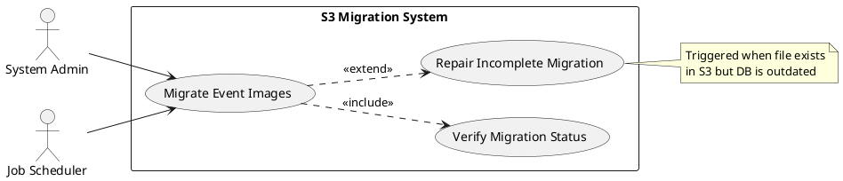
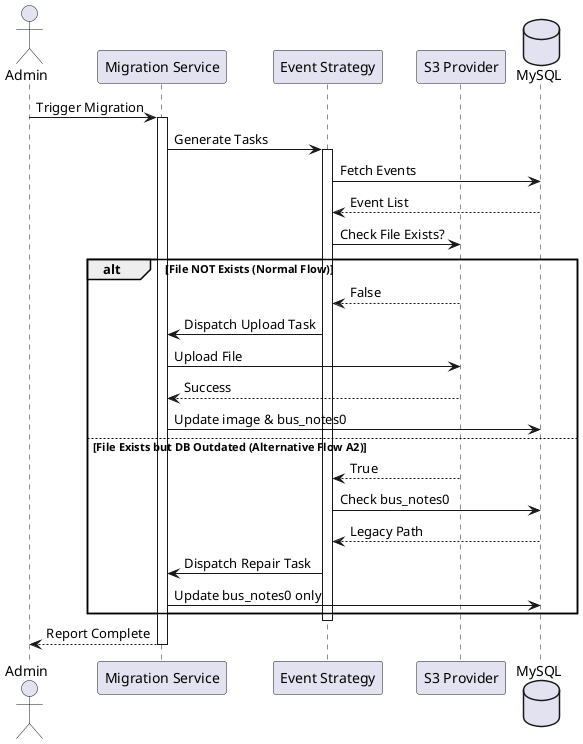
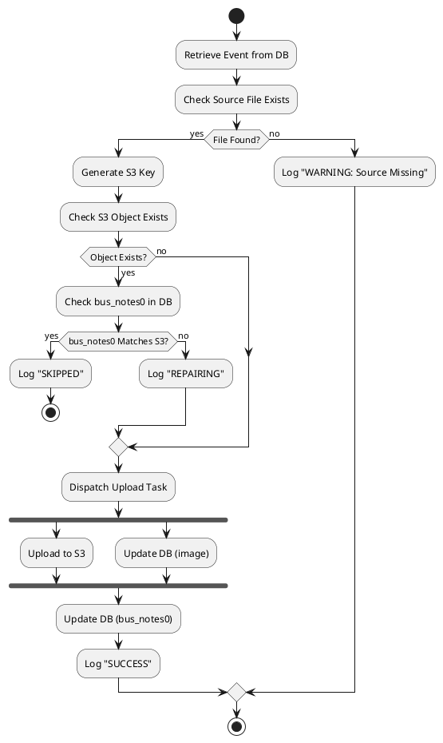
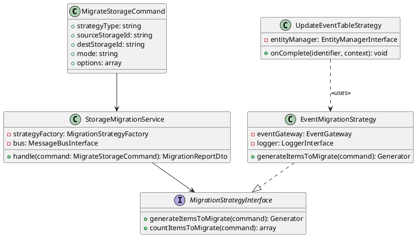
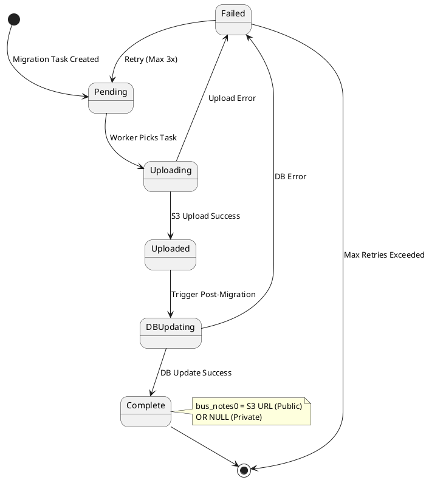
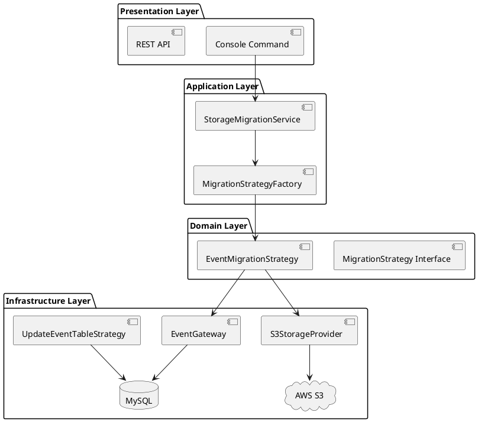

# 🎨 UML Mastery

This skill provides comprehensive UML modeling capabilities using **PlantUML** syntax (text-based, version-controllable).


## 2. When to use this skill
This skill is activated when the task requires Comprehensive UML (Unified Modeling Language) expertise for visualizing system architecture, behavior, and interactions using industry-standard diagrams..
- Detected when the user's intent matches the semantic domain of 🎨 UML Mastery.
- Triggered by technical requirements or explicit architectural requests.

## 3. How to use it

### 📐 Core Diagrams
### 1️⃣ Use Case Diagram
**Purpose**: Show actors and their interactions with the system.
**When to use**: During requirements analysis, to visualize user goals.

**Template**: `templates/use-case-diagram.puml`



---

### 2️⃣ Sequence Diagram
**Purpose**: Show step-by-step interaction between actors and system components over time.
**When to use**: To detail Normal Flow, Alternative Flow, and Exception Flow.

**Template**: `templates/sequence-diagram.puml`



---

### 3️⃣ Activity Diagram
**Purpose**: Show workflow with decision points and parallel processes.
**When to use**: To visualize complex business logic with branches.

**Template**: `templates/activity-diagram.puml`



---

### 4️⃣ Class Diagram
**Purpose**: Show system structure (entities, value objects, relationships).
**When to use**: Domain modeling, architecture documentation.

**Template**: `templates/class-diagram.puml`



---

### 5️⃣ State Diagram
**Purpose**: Show object lifecycle and state transitions.
**When to use**: For entities with complex state management.

**Template**: `templates/state-diagram.puml`



---

### 6️⃣ Component Diagram
**Purpose**: Show high-level system architecture and dependencies.
**When to use**: Architecture overview, deployment planning.

**Template**: `templates/component-diagram.puml`



---

### 🔧 Usage Protocol
### For Agents:
1. **Identify Diagram Need**: Based on task context (requirements, design, testing).
2. **Select Template**: Choose appropriate diagram type from above.
3. **Customize**: Replace placeholder names with actual system entities.
4. **Save**: Store `.puml` files alongside documentation (e.g., `artifacts/uml/`).
5. **Render** (Optional): Use PlantUML CLI/online to generate PNG/SVG.

### Integration with Other Skills:
- **quality-assurance-mastery**: Auto-generate Use Case + Sequence diagrams during spec creation.
- **architecture-blueprint-mastery**: Use Component + Class diagrams for design phase.
- **ddd-mastery**: Use Class diagrams for Domain Model visualization.

---

### 📦 Output Structure
When creating UML artifacts, save them in:
```
/home/puterakahfi/.agent/workspace/arbiter/artifacts/uml/
├── [project-id]/
│   ├── use-case/
│   │   └── ASD-5921-migration.puml
│   ├── sequence/
│   │   └── ASD-5921-normal-flow.puml
│   └── class/
│       └── storage-migration-domain.puml
```

---

### 🎯 Best Practices
1. **Keep it Simple**: Don't over-complicate diagrams. Focus on clarity.
2. **Version Control**: `.puml` files are text, perfect for Git.
3. **Consistency**: Use same naming conventions across all diagrams.
4. **Annotations**: Add notes for non-obvious logic or business rules.
5. **Layering**: Separate concerns (don't mix Use Case with Class diagrams).

